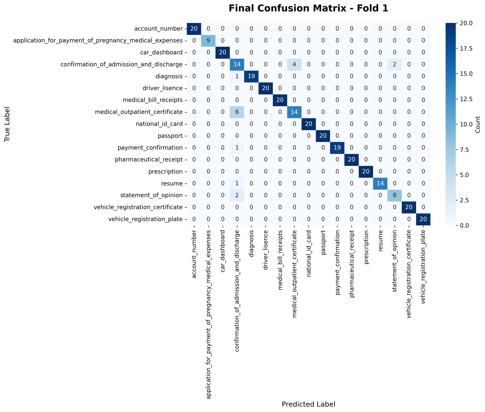

# **[Computer Vision] Document Type Classification**

## **💻 Project Overview**
### Environment
- **OS:** Linux Ubuntu 20.04.6 LTS
- **GPU:** NVIDIA GeForce RTX 3090
- **Tool:** VS Code / Google Colab
- **Language:** Python 3.10.13

### Requirements
- albumentations==1.3.1
- augraphy==8.2.6
- jupyter==1.0.0
- matplotlib==3.10.8
- numpy==1.26.4
- pandas==2.1.4
- Pillow==9.4.0
- python-dotenv==1.2.1
- pytorch==2.1.0
- seaborn==0.13.2
- scikit-learn==1.7.2
- timm==0.9.12
- torchvision==0.16.0
- tqdm==4.65.0
- transformers==4.36.0
- wandb==0.24.0

<br>

## **📋 Competition Info**
### 문서타입분류대회로 총17종의 이미지데이터를 클래스별로 분류한다.
- 계좌번호, 자동차 번호판, 자동차 계기판, 진료비영수증, 여권, 운전면허증
- 주민등록증, 자동차 등록증, 약제비 영수증, 처방전, 통원/진료 확인서, 입퇴원 확인서
- 진단서, 진료비 납입 확인서, 이력서, 소견서, 건강보험 임신출산 진료비 지급 신청서

### 학습데이터셋 정보
- 학습데이터: 총 1570장
- 클래스별 이미지: 46~100장

### 테스트데이터셋 정보
- 테스트데이터: 총 3140장
- 난이도 조절을 위해 여러 augmentations 적용

### 평가지표 (Evaluation Metric)
- Macro F1 score: 각 클래스에 대한 F1 score를 개별적으로 계산 후, 평균

<br>

## **⚙️ Components**
### Directory
```
├── assets/...                 # README images
├── code/
│   ├── .env                   # 경로설정
│   ├── baseline.ipynb         # baseline code
│   ├── cascade.py             # ConvNeXt + ConvNeXt Special code 병합
│   ├── cv_dtc_v6_conv.py      # ConvNeXt V2
│   ├── cv_dtc_v6_convspec.py  # ConvNeXt Special
│   ├── cv_dtc_v6_deit.py      # DeiT III
│   ├── cv_dtc_v6_maxvit.py    # MaxViT Base
│   ├── cv_dtc_v6_swin.py      # Swin Transformer V2
│   ├── snapshot_conv.py       # Snapshot 실수 복원
│   └── snapshot_convspec.py   # 실패한 fold 제외 후 재실험
├── data/                      # 이하 GitHub 관리안함
│   ├── checkpoints/...        # checkpoint 파일
│   ├── confusionmatrix/...    # fold별 CM 파일
│   ├── test/...               # test images
│   ├── train/...              # train images
│   ├── meta.csv               # class mapping info
│   ├── output.csv             # 제출할 파일 생성
│   ├── sample_submission.csv  # 0으로 초기화된 제출파일 template
│   └── train.csv              # train 정답파일
├── wandb/...                  # WandB log (GitHub 관리안함)
├── .gitignore
├── LICENSE
├── README.md
└── requirements.txt
```

<br>

## **💾 Data Descrption**
### Confusion Matrix


### Data Processing
- 검증셋은 80:20으로 분리, 학습데이터의 과적합을 피하기 위해 K-Fold 옵션으로 쪼개되
17종 클래스 비율이 동일하게 들어가도록 Stratified를 사용해 모델의 일반화 성능을 높인다.

- 검증셋에는 augmentation 없이 정규화만 적용한다.
원본 학습데이터 1본, 코드상에서 원본 학습데이터를 복제하여 각종 디지털 노이즈를 적용시킨 증강본, 투트랙으로 2배 증식시켜 학습데이터의 양적부족도 커버하면서 다양성을 높인다.

- 기본 100장보다도 더 모자란 3개 클래스는 oversampling으로 다른 클래스들과 키를 맞춘다.
그 후 특히 혼동되는 클래스들은 따로 골라 추가 oversampling하고 가중치를 더 강하게 준다.

- 모델 선택: 전통적인 CNN 계열부터 시작해서 문서 이해에 더 최적화된 SOTA 모델들까지 모두 적용해 본 뒤
CNN과 Transformer 계열로 나눠 각각 성과가 가장 좋은 모델들만 골라 앙상블한다.

- 이미지들의 사이즈가 너무 작으면 식별이 어려우므로 최대한 키우고 싶었으나 그러면 소요되는 GPU 메모리 용량과 학습시간을 감당할 수 없다.
모델들의 특성과 스펙을 꼼꼼하게 점검한 후 일괄 512px로 결정하고 같은 모델 내에서도 512에 적합한 버전을 골랐다.

- 테스트데이터는 노이즈와 반전, 회전, 크롭, 마스킹 등으로 가득차 있다.
3번 입퇴원확인서, 7번 통원진료확인서, 4번 진단서, 14번 소견서만 전문적으로 식별하기 위해 마련된 일명 지옥의 노이즈 좀비 잡는 특공대를 마련.
이 특공대는 원본, 메인 모델의 증강본 외에 극악의 3단계 매운맛 노이즈 증강본이 존재한다.
다뤄야 하는 클래스 수가 줄었으니 가중치, 오버샘플링도 더 세게.
이 4개 클래스만 뽑아 relabeling한 뒤 최종 결과물에 inverse Mapping을 적용하여 메인모델과 cascade하고 이를 ensemble에 적용하여 최종 결과를 도출하는 방식이다.

- Seed Ensemble: 적용하는 모델들의 Seed를 전부 다르게 둔다.
그러나 동일 코드에 대해서 소수점까지 재현이 가능하도록 CuDNN 결정론적 연산 설정을 추가했다.

- 그 외 Hyper-parameter Ensemble, Snapshot Ensemble도 적용해 보고
Model Ensemble은 모델별 가중치를 부여한 Weighted Soft Voting을 사용하여 모든 경우의 수를 다 적용해본다.

<br>

## **🧠 Modeling**
### Model Descrition
#### – MaxViT Base (maxvit_base_tf_512.in21k_ft_in1k)
- Multi-Axis Attention: Blocked Attention (국소적 정보) + Grid Attention (전역적 정보)
- MBConv(CNN 구조)와 Attention(Transformer 구조)의 하이브리드

#### – ConvNeXt V2 (convnextv2_base.fcmae_ft_in22k_in1k)
- Transformer의 장점을 흡수한 완성형 CNN
- FCMAE (Fully Convolutional Masked Autoencoder)
- GRN (Global Response Normalization) Layer

#### – DeiT III (deit3_base_patch16_384.fb_in22k_ft_in1k)
- 강력한 증강 기법과 향상된 학습 레시피
- 순수 Transformer 구조 기반

#### – Swin Transformer V2 (swinv2_base_window12to16_192to256.ms_in22k_ft_in1k)
- 계층적 구조 (Hierarchical Feature Maps)
- 윈도우 기반 어텐션 (Shifted Window Attention)
- V2에서 개선된 안정성 (Log-CPB & Post-Norm)

### Modeling Process
- ResNet50, EfficientNet-B3, Swin-Base, Swin-Large, ConvNeXt, DeiT, MaxViT 순으로 테스트
- IMG_SIZE = 512, LR = 1e-5 / 5e-5, EPOCHS = 20, BATCH_SIZE = 4~16, NUM_WORKERS = 16 기본값
- DeiT는 가볍고 중간 성과도 좋았으나 시간 부족으로 비슷한 계열의 더 고성능 모델인 MaxViT만 반영하고 우선순위 밀림
- Swin은 고전적 CNN 모델에 비해서는 좋은 성과를 보이나 ConvNeXt 이후로 계속 성능면에서 밀리며 결국 앙상블 제외
- MaxViT는 성능은 좋으나 지나치게 무거운게 단점
- 최종 MaxViT와 ConvNeXt의 model ensemble 선정: 둘은 다른 계열이라 공략하는 클래스가 다르기 때문

<br>

## **📊 Experiment Logger**
<table>
  <thead>
    <tr>
      <th>No.</th>
      <th>날짜</th>
      <th>모델</th>
      <th>주요변경사항</th>
      <th>Augmentation</th>
      <th>&nbsp;LR&nbsp;</th>
      <th colspan="2">점수 / 결과</th>
    </tr>
  </thead>
  <tbody>
    <tr>
      <td align="center">#01</td>
      <td align="center">20260123</td>
      <td>ResNet50</td>
      <td>기본 제공 코드</td>
      <td>None (Base)</td>
      <td align="center">1e-4</td>
      <td align="center">0.4195</td>
      <td align="center">S</td>
    </tr>
    <tr>
      <td align="center">#02</td>
      <td align="center">20260123</td>
      <td>EfficientNet-B3</td>
      <td>검증셋 분리</td>
      <td>Brightness, Rotation</td>
      <td align="center">1e-4</td>
      <td align="center">0.5070</td>
      <td align="center">S</td>
    </tr>
    <tr>
      <td align="center">#03</td>
      <td align="center">20260124</td>
      <td>Swin-Base 384</td>
      <td>Stratified 5-Fold</td>
      <td>Flip, Noise</td>
      <td align="center">5e-5</td>
      <td align="center">0.8105</td>
      <td align="center">S</td>
    </tr>
    <tr>
      <td align="center">#04</td>
      <td align="center">20260125</td>
      <td>Swin-Large 384</td>
      <td>Mixup, TTA</td>
      <td></td>
      <td align="center">5e-5</td>
      <td align="center">0.7133</td>
      <td align="center">F</td>
    </tr>
    <tr>
      <td align="center">#05</td>
      <td align="center">20260125</td>
      <td>Swin-Base 384</td>
      <td>Oversampling</td>
      <td>Resize, Padding</td>
      <td align="center">1e-4</td>
      <td align="center">0.8047</td>
      <td align="center">F</td>
    </tr>
    <tr>
      <td align="center">#06</td>
      <td align="center">20260126</td>
      <td>ConvNeXt-Base</td>
      <td></td>
      <td>RandomRotate90</td>
      <td align="center">1e-4</td>
      <td align="center">0.8678</td>
      <td align="center">S</td>
    </tr>
    <tr>
      <td align="center">#07</td>
      <td align="center">20260126</td>
      <td></td>
      <td>TTA</td>
      <td>Crop</td>
      <td align="center">1e-4</td>
      <td align="center">0.9049</td>
      <td align="center">S</td>
    </tr>
    <tr>
      <td colspan="8" align="center">. . .</td>
    </tr>
    <tr>
      <td align="center">#99</td>
      <td align="center">20260204</td>
      <td>MaxViT+ConvNeXt</td>
      <td>Ensemble</td>
      <td>Augraphy</td>
      <td align="center">5e-5</td>
      <td align="center">0.9742</td>
      <td align="center">S</td>
    </tr>
  </tbody>
</table>
<br>


<br>

## **🏆 Champion Model Info**
- **Version:** V6 (MaxViT)
- **Training Time:** 17h 21m
- **Time per Epoch:** 14m 40s
- **Accuracy:** 97.42%

<br>

## **🚀 Result**
### Leaderboard Rank: No. 1 🥇 (mid F1: 0.9742 / final F1: 0.9634)


<br>

## **📜 Version Log**
### V1: Baseline Format Check
- Jupyter Notebook을 Python script로 변환
- Baseline code에서 hyperparameter 변경

### V2: EfficientNet-B3
- Path env 설정
- Seed CuDNN 결정론적 연산 설정 추가
- Code formatting
- Model & Optimizer 변경: EfficientNet-B3, AdamW
- Augmentation 추가
- Training / validation sets 분리

### V3: Swin-Base 384
- Best val macro F1 checkpoint 저장
- Early stopping
- Stratified K-Fold + fold ensemble 추론
- Model 변경: Swin-Base 384
- Augmentation 추가
- Hyperparameter 변경

### V4: ConvNeXt-Base
- WandB 적용, Confusion Matrix 적용
- Oversampling 적용
- Image Size 증가 후 padding 적용
- Model 변경: ConvNeXt-Base
- Augmentation 추가

### V5: ConvNeXt-Base (동일)
- Code cleanup (Stratified K-Fold 단일 운영)
- TTA (Test Time Augmentation) 적용
- Augmentation 추가

### V6: MaxViT + ConvNeXt Ensemble
- Augraphy 적용
- 7,3,4,14 클래스에 특화되고 추가 노이즈 증강본이 적용된 special 코드 작성
- 별도 special 코드를 ConvNeXt와 cascade
- cascade한 ConvNeXt를 MaxViT와 ensemble (Weighted Soft Voting)

<br>

## **🛠️ Project Development Log**
### 2026-01-18 (Sun)
- **Key Task:** 프로젝트 착수
- **Note:** 일정 수립 (Notion 사용), GitHub 설정

### 2026-01-19 (Mon)
- **Key Task:** 개발 환경 설정
- **Note:** VS Code Extensions & library 설치, 서버 설정, SSH 접속 확인

### 2026-01-23 (Fri)
- **Key Task:** Leaderboard 첫 제출 완료
- **Note:** Baseline pipeline 검증, V1, V2 개발

### 2026-01-24 (Sat)
- **Key Task:** 검증셋 분리, 정체된 f1 score 개선
- **Result:** Leaderboard 🥇 갱신
- **Note:** V3 개발 (Swin Transformer와 Stratified 5-Fold가 극적 효과)

### 2026-01-25 (Sun)
- **Key Task:** f1 score 최고점 갱신 시도
- **Result:** Fail (0.0972 하락)
- **Note:** Swin-Large, Mixup, TTA 시도해 봤으나 모두 실패, WandB logging 적용

### 2026-01-26 (Mon)
- **Key Task:** Confusion Matrix 적용
- **Note:** 실패한 모델은 폐기하고 best로 실험환경 원복하는 기준 적용
<br>V4 개발 (Confusion Matrix를 통해 문제있는 클래스들을 적발, oversampling과 맞춤형 증강 추가)
<br>Code cleanup, TTA 재시도 (증강이 많이 추가되어 성공), EDA 후 잘린 문서 많아 crop 추가

### 2026-01-27 (Tue)
- **Note:** 지나친 증강으로 V5_02 실험 실패 (리더보드 미제출)

### 2026-01-28 (Wed)
- **Note:** 이후 개발 로그 기록할 시간도 없이 시간에 쫓김..😵‍💫
<br>내가 한 짓은 WandB가 알고 있다..ㅎㅎㅎ

### 2026-02-04 (Wed)
- **Note:** 리더보드 1위 달성 🥇 대회 마감!🏆 끝이 좋으면 다 좋다. :)

<br>

## **🕰️ 프로젝트 회고**
개발이 진행되면서 훈련 시간이 천문학적으로 늘며 CODE>WAIT>CODE>쪽잠>REPEAT의 반복이었던 2주였습니다. 특히 14시간짜리 실험이 대실패로 끝나거나, 학습 도중 0.01대의 괴랄한 F1로 모델이 폭주해버려 성공한 폴드만 일부 수습해서 재실험을 시도한다거나, 엄청난 기대를 걸었던 3,7 클래스 귀신잡는 특공대가 의외로 하찮은 성과를 내거나, 온갖 시행착오를 겪으며 실전감각을 몸으로 익히는게 자학적으로(ㅠㅠ) 즐거웠습니다.
특정 클래스의 가중치를 한 스푼만 높여도, 앙상블 도중 한쪽의 soft voting 비율을 1%만 낮춰도 개복치 같은 리더보드에 배신당하기를 반복하며 내가 베이킹을 하는건지 AI 개발을 하는건지 싶을 때도 있었지만, OCD 성향을 살려 데이터를 집요하게 비교분석하고 클래스별로 약점을 핀셋 공략해 결국 제 가설이 성공으로 입증되는 과정은 꽤 뿌듯했습니다.

<br>
